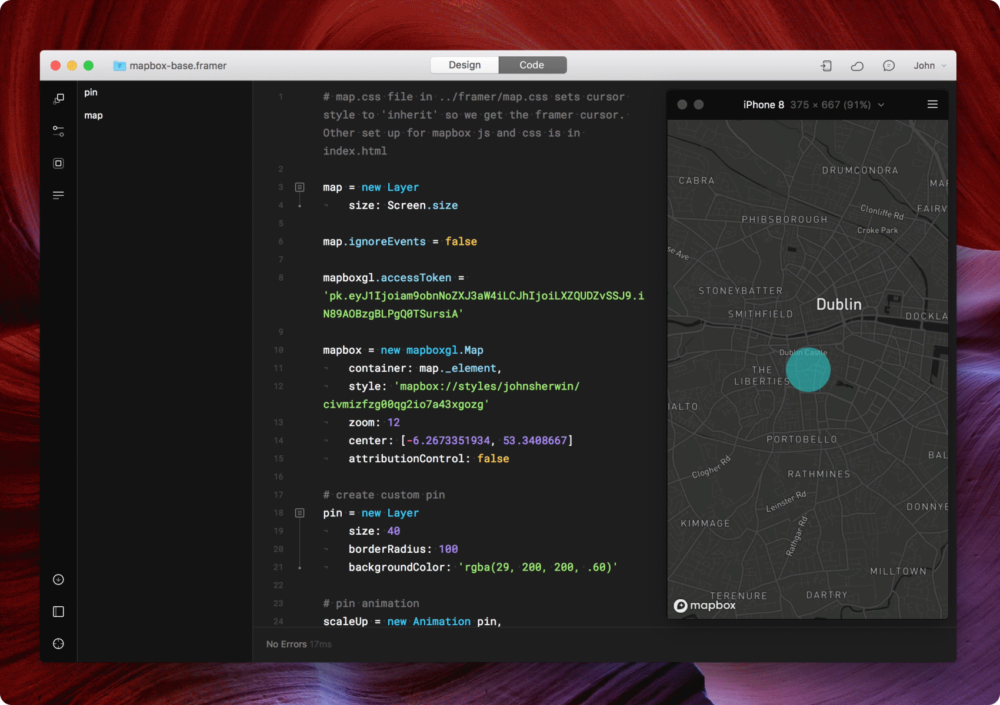

# Framer Mapbox Quick-Start

## Introduction
I put together this little quickstart project as a means of getting set up with Mapbox in Framer quickly. It also gets around some of the problems created with recent updates to Mapbox GL JS. 

You'll need to use the access token from your own Mapbox account as well as the style url for the style you want to use. 

## Mapbox JS & CSS
The Mapbox JavaScript and CSS import is done in the index.html file in the Framer project folder. There's also an additional CSS file called map.css in the /framer folder that fixes some issues with the custom cursor in Framer.